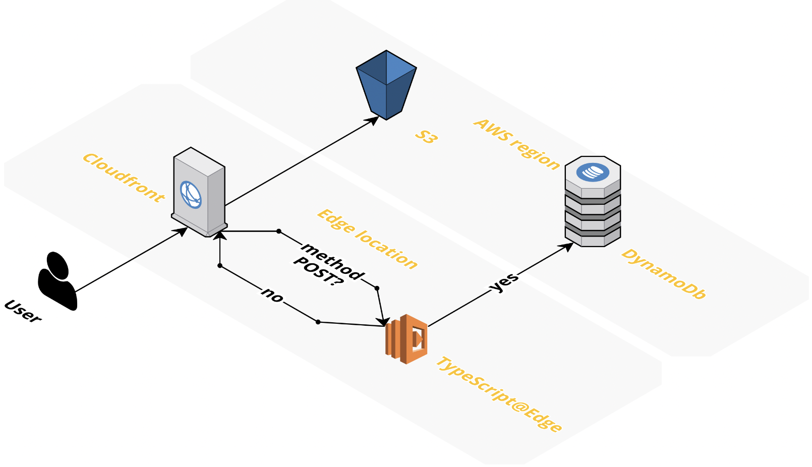

# aws-typescript-cloudfront-dynamodb-terraform
Example infrastructure as code (IaC) of how to
deploy Typescript at the edge (Lambda@Edge) and
use it to write into DynamoDb



## Requirements
1. Terraform
2. NodeJS

## Deployment instructions
```
make deploy
```

## Testing
```
make test
```